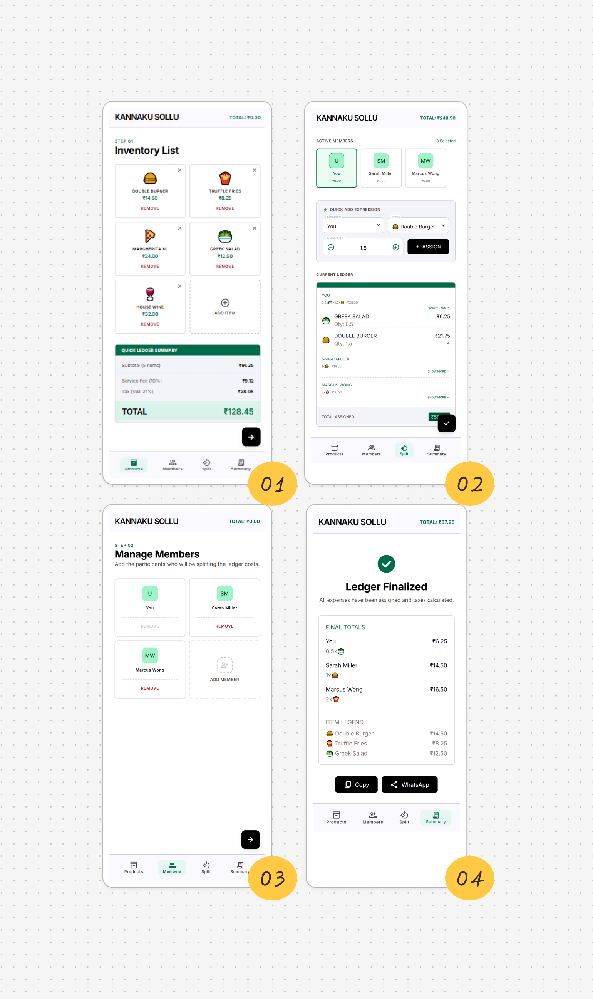
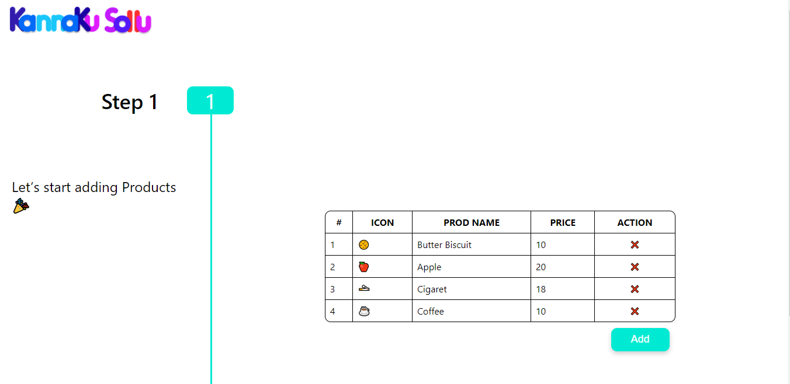
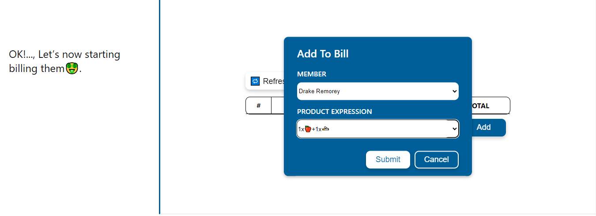
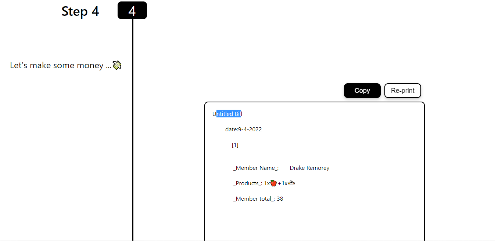

## Kannaku Sollu in a web application that helps generate cute and easy to understand bill that you can share with your friends, to let them know what they owe you 👁‍🗨

 

[Link to the application 🔗](https://suvel.github.io/kannaku_sollu/)

### Latest version : V2

**version update**

* Update the UI for Mobile centric users
* Added test case for relablity

I have used Google Stitch to generate the UI for the application.

### 🎨 Style Guide

The V2 UI follows the visual identitytechnical brutalism blended with modern systematic utility, for a clear-cut digital paper trail.

**Design Principles**

* **Vertical Efficiency** Content stacks logically to minimize lateral eye movement on narrow screens.
* **Clear CTA** High-contrast solid elements guide the user toward finalization.
* **Emoji Core** Data is paired with expressive icons to soften the technical brutality.

[click here](./for_docs/style_guid.md) to navigate to Style Guid.

 

 **Incase if you feel like contributing**, [click here](https://github.com/suvel/kannaku_sollu/issues) to navigate to github issues.

</aside>

### Latest version : V1

   

 

