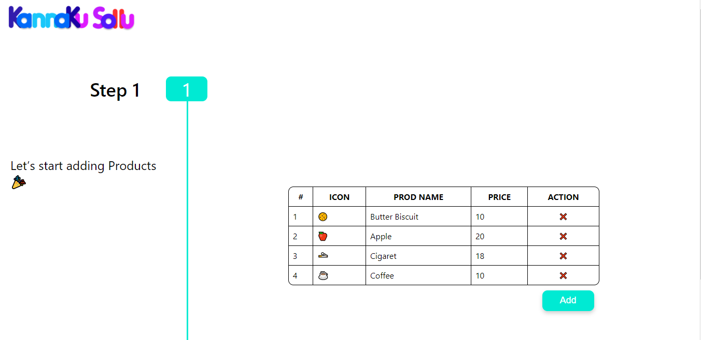
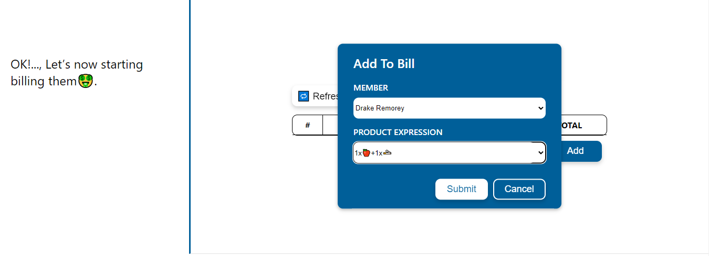
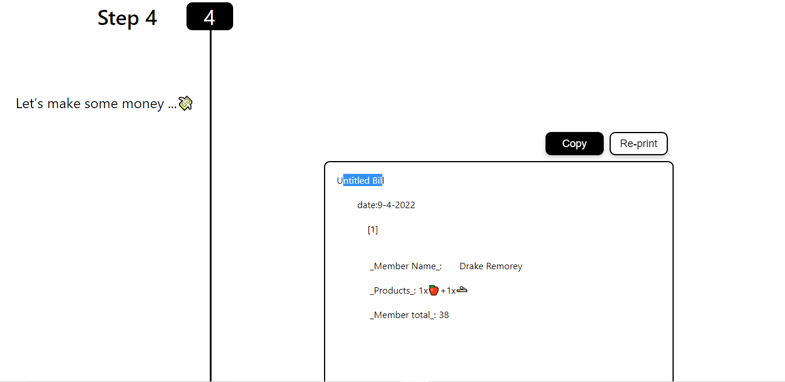

## Kannaku Sollu in a web application that helps generate cute and easy to understand bill that you can share with your friends, to let them know what they owe you 👁‍🗨

 

[Link to the application 🔗](https://suvel.github.io/kannaku_sollu/)

   

 

### Latest version : V0.2

[Check the change log for V0.2](https://github.com/suvel/kannaku_sollu/issues/1)

<aside>
<q>I would really appreciate if you can try the application out and report some UX or bugs</q>

 

 **Incase if you feel like contributing**, [click here](https://github.com/suvel/kannaku_sollu/issues) to navigate to github issues.

</aside>

